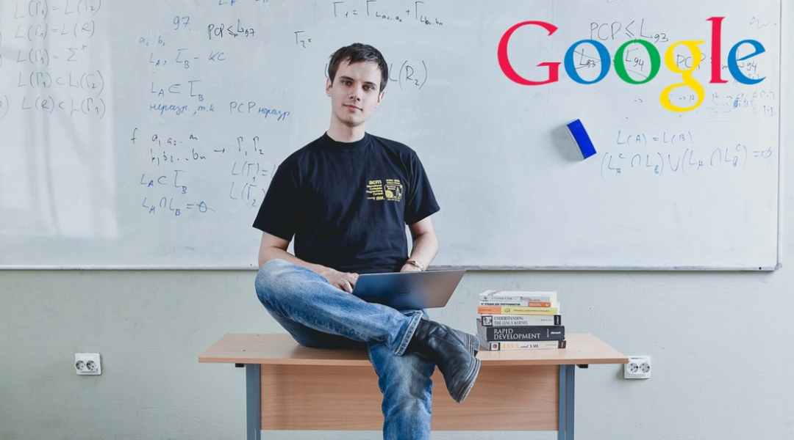

# BCC



Competitive programming practice repo - solutions and grinding from various judges.


## Folders

- **contests/** - Weekly contest submissions (plus final contest)
- **internship/** - Structured practice from Codeforces, CSES, Codewars
- **grinding/** - General practice problems
- **learning/** - Algorithm learning (binary search, graphs, sliding window, etc.)
- **live/** - Live coding practice

## Platforms

- [Codeforces](https://codeforces.com/)
- [CSES](https://cses.fi/problemset/)
- [Codewars](https://www.codewars.com/)

## Compile

```bash
g++ -o out filename.cpp
./out
```

Or with flags:

```bash
g++ -O2 -std=c++17 -o out filename.cpp
```

It is recommended to use the [CPH extension](https://marketplace.visualstudio.com/items?itemName=DivyanshuAgrawal.competitive-programming-helper) on VSCode - All code is in C++.

## Snippets

If you want to use the snippets I use, copy the content of [snippets.json](./snippets.json) into your VSCode's JSON file for C++.
